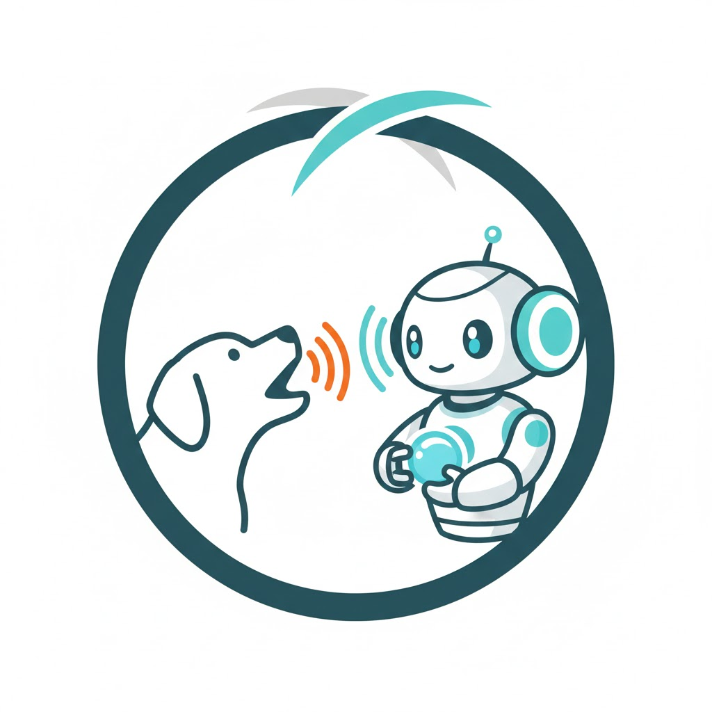

<div align="center">
  
</div>

# Dog Bark Detection System for Home Assistant

A lightweight, real-time bark detection system that monitors audio from a USB microphone and reports barking events to Home Assistant via MQTT. Uses simple decibel threshold analysis for fast, reliable detection without requiring machine learning models.

## Features

- Real-time bark detection using decibel burst analysis
- MQTT integration with Home Assistant auto-discovery
- Configurable thresholds for sensitivity tuning
- Automatic reconnection and retry logic for reliability
- Systemd service for continuous operation with auto-restart
- Low resource usage (< 5% CPU, < 50 MB RAM)
- Comprehensive logging with configurable levels

## Hardware Requirements

- USB Microphone: Blue Snowball or any USB audio device
- Linux system with Python 3.8+, USB audio access, and network connectivity

## System Dependencies

Before installing the Python packages, you need to install system-level audio libraries. The `sounddevice` package requires **PortAudio** to be installed at the system level.

**Ubuntu/Debian:**
```bash
sudo apt-get update
sudo apt-get install portaudio19-dev python3-dev
```

**Fedora/RHEL:**
```bash
sudo dnf install portaudio-devel python3-devel
```

**Arch Linux:**
```bash
sudo pacman -S portaudio
```

**macOS (Homebrew):**
```bash
brew install portaudio
```

## Installation

### 1. Clone and Install Dependencies

```bash
cd ~/Projects
git clone <repository-url>
cd ha-bark-detection
curl -LsSf https://astral.sh/uv/install.sh | sh  # Install uv if needed
uv sync
```

### 2. Configure

```bash
cp .env.example .env
nano .env  # Edit configuration
```

### 3. Test

```bash
uv run python -m bark_detector.main
```

### 4. Install Service

```bash
./systemd/install_service.sh
```

## Usage

```bash
systemctl --user start bark-detector
systemctl --user status bark-detector
journalctl --user -u bark-detector -f
```

## Troubleshooting

### ❌ OSError: PortAudio library not found

**Cause:** The PortAudio system library is not installed.

**Solution:** Install the system dependencies for your distribution (see [System Dependencies](#system-dependencies) section above).

After installing, restart the service:
```bash
systemctl --user restart bark-detector
```

### ❌ Service keeps restarting / restart counter increasing

**Check the logs to see the actual error:**
```bash
journalctl --user -u bark-detector -n 50
```

Common causes:
- Missing PortAudio library (see above)
- `.env` file not configured or missing required values
- MQTT broker unreachable
- Audio device not accessible

### ❌ Audio device not found

**List available audio devices:**
```bash
uv run python -c "import sounddevice as sd; print(sd.query_devices())"
```

**Solution:** Update the `AUDIO_DEVICE_INDEX` in your `.env` file to match your microphone's device index.

### ❌ MQTT connection failed

**Check:**
- MQTT broker is running and accessible
- `MQTT_BROKER`, `MQTT_PORT` are correct in `.env`
- Network connectivity to the broker
- Firewall rules allow MQTT traffic (default port 1883)

**Test MQTT connection:**
```bash
# Install mosquitto clients
sudo apt-get install mosquitto-clients

# Test connection
mosquitto_sub -h <your-broker-ip> -t "homeassistant/#" -v
```

## License

This project is licensed under the Mozilla Public License 2.0 - see the [LICENSE](LICENSE) file for details.
